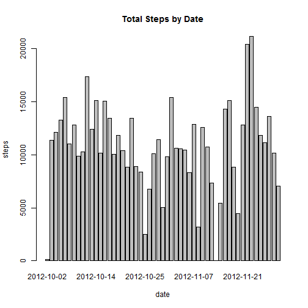
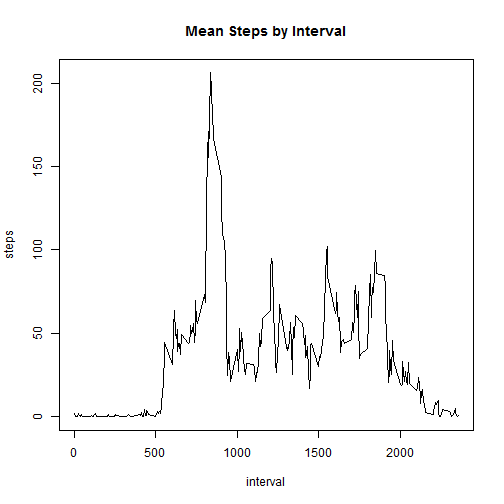
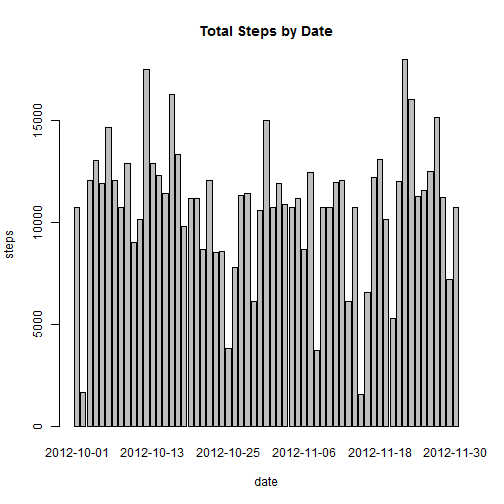
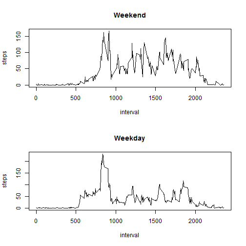

Reproducible Research Peer Assessment #1
========================================================

This process utilizes is.weekend function in chron package. Install the package before proceeding.


```r
library(chron)
```

### Loading and preprocessing the data


```r
df <- read.table("activity.csv",sep=",",header=TRUE)
```
### What is the mean total number of steps taken per day?

Make a histogram of the total number of steps taken each day Aggregation of steps by date.   


```r
sum_of_steps <- aggregate(steps ~ date, data=df, FUN=sum)
barplot(sum_of_steps$steps, names.arg = sum_of_steps$date, xlab = "date", ylab = "steps", main = "Total Steps by Date")
```

 

Calculate and report the mean and median total number of steps taken per day.   


```r
mean(sum_of_steps$steps)
```

```
## [1] 10766
```

```r
median(sum_of_steps$steps)
```

```
## [1] 10765
```

### What is the average daily activity pattern?

Make a time series plot of the 5-minutes interval and the average number of steps taken, averaged across all days.


```r
steps_by_int <- aggregate(steps ~ interval, data=df, FUN=mean)
plot(steps_by_int, type="l", xlab="interval", ylab="steps", main = "Mean Steps by Interval")
```

 

Which 5-minute interval, on average across all the days in the dataset, contains the maximum number of steps?


```r
steps_by_int$interval[which(steps_by_int$steps==max(steps_by_int$steps))]
```

```
## [1] 835
```

### Imputing missing values

Calculate and report the total number of missing values in the dataset.


```r
na_idx <- is.na(df$steps)
sum(na_idx)
```

```
## [1] 2304
```

Devise a strategy for filling in all of the missing values in the dataset. 
Recode missing value with mean daily activity pattern


```r
df1 <- data.frame(interval=steps_by_int$interval, mean_steps=steps_by_int$steps)
df <- merge(dt, df1, by="interval")
df$steps[na_idx] <- df$mean_steps[na_idx]
```

Create a new dataset that is equal to the original dataset but with the missing data filled in.


```r
df <- df[,1:3]
df[2] <- round(df[2],digits = 0)
```

Make a histogram of the total number of steps taken each day and Calculate and report the mean and median total number of steps taken per day. Do these values differ from the estimates from the first part of the assignment? 


```r
# What is the impact of imputing missing data on the estimates of the total daily number of steps?
sum_of_steps <- aggregate(steps ~ date, data=df, FUN=sum)
barplot(sum_of_steps$steps, names.arg = sum_of_steps$date, xlab = "date", ylab = "steps", main = "Total Steps by Date")
```

 

```r
mean(sum_of_steps$steps)
```

```
## [1] 10773
```

```r
median(sum_of_steps$steps)
```

```
## [1] 11215
```

The mean and median shifted higher after imputing the missing data with mean of the steps by interval.

### Are there differences in activity patterns between weekdays and weekends?

Create a new factor variable in the dataset with two levels - "weekday" and "weekend" indicating whether a given date is a weekday or weekend day.


```r
weekend <- data.frame(date=df$date,weekend=is.weekend(as.Date(df$date)))
df <- cbind(df, weekend[2])
```

Make a panel plot containing a time series plot of the 5-minute interval (x-axis) and the average number of steps taken, averaged across all weekday days or weekend days (y-axis). 


```r
weekend <- aggregate(steps ~ interval, data=df[df$weekend==TRUE,], FUN=mean)
weekday <- aggregate(steps ~ interval, data=df[df$weekend==FALSE,], FUN=mean)

par(mfrow = c(2, 1))
plot(weekend, type="l", xlab="interval", ylab="steps", main = "Weekend")
plot(weekday, type="l", xlab="interval", ylab="steps", main = "Weekday")
```

 
